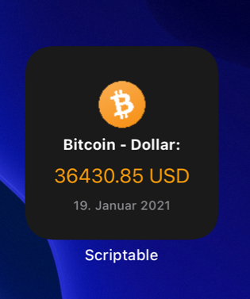

# btc-usd-course.js
 A Scriptable widget that shows the current bitcoin course in US-Dollar based on coinbase

 
 

 

 <p>
   <a href="#setup">Setup</a> •
   <a href="#usage">Usage</a> •
   <a href="#links">Links</a> •
   <a href="#contribution">Contribution</a> •
 </p>

 ## Setup

 1. (if not done yet) Download the scriptable app form [AppStore](https://apps.apple.com/de/app/scriptable/id1405459188)
 2. In Scriptable create a new script
 3. Copy the code from script file [btc-usd-course.js](https://github.com/wickenico/btc-usd-course.js/blob/main/btc-usd-course.js)
 4. Create a new widget on homescreen and select this script in scriptable

 ## Usage
 ### Change displayed currency

 You can change the currency directly in the api url on line 14. <br>
 For example show bitcoin price in €/EUR:

 ```javascript
 const url = 'https://api.coinbase.com/v2/prices/spot?currency=EUR'
 ```

 ## Links
 - Coinbase API Price Data: https://developers.coinbase.com/docs/wallet/guides/price-data
 - Currency codes overview: https://www2.1010data.com/documentationcenter/beta/1010dataReferenceManual/DataTypesAndFormats/currencyUnitCodes.html


 ## Contribution

 If you have any ideas for extensions or changes just let me know.

 ## TODO

 - Change currceny name in headline
 - Add rounding for numbers
 - Add up and down tracker
 - Add parameter for currency and coin
